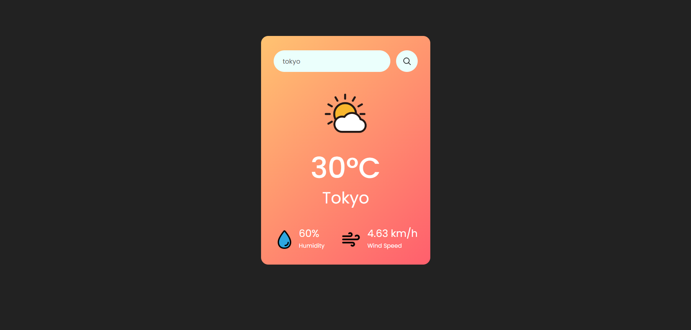

# weathercast
Weathercast is a lightweight weather application that allows users to check the current weather information for a specific location. It provides real-time weather data, including temperature, humidity, wind speed, and weather conditions. The app utilizes the <a href="https://openweathermap.org/" target="_blank">OpenWeatherMap API</a> to fetch weather data.

<a href=https://danielrzhang-weathercast.netlify.app target="_blank">Try it out here!</a>

## Features
* **Current Weather Information:** Gets the current weather details for a specific location, including temperature (in degrees Celsius), humidity, wind speed, and weather conditions.
* **Search by Location:** Enter the name of a town, city, province/state, or country in the search box to get the weather information for that location.
* **Responsive Design:** The app is designed to be responsive and can adapt to different screen sizes, making it suitable for use on both desktop and mobile devices.

## Installation
1. Clone the repository.

    `git clone https://github.com/danielrzhang/weathercast.git`
2. Navigate to the project directory.

    `cd weathercast`

3. Paste your own API key into the `api-key.js` file from <a href="https://openweathermap.org/" target="_blank">OpenWeatherMap API</a>.

4. Deploy the app to your preferred hosting platform, or use GitHub Pages for quick deployment.
